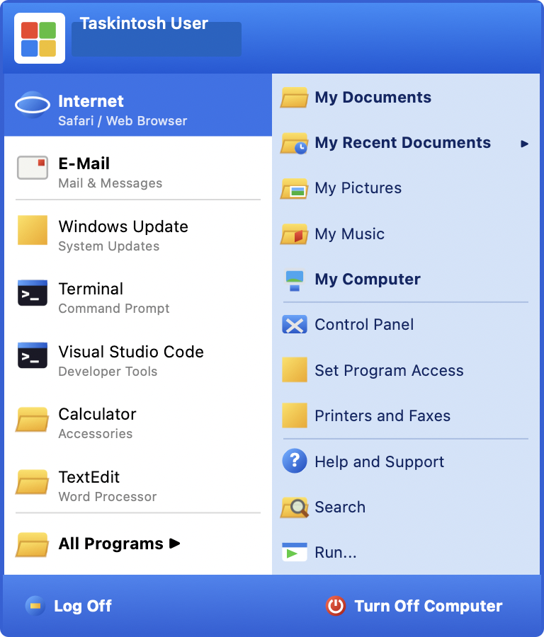
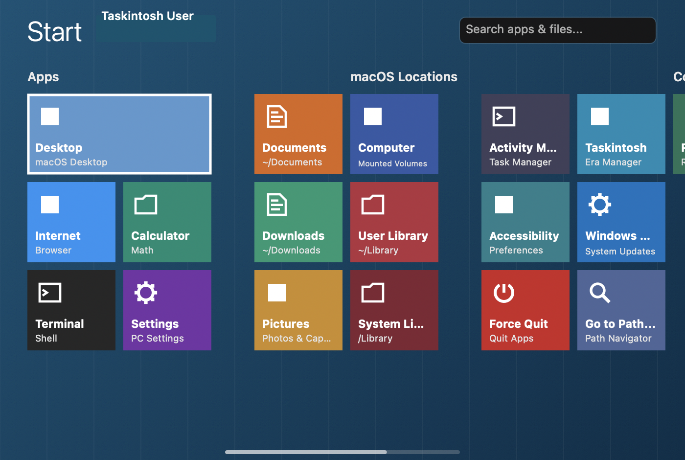
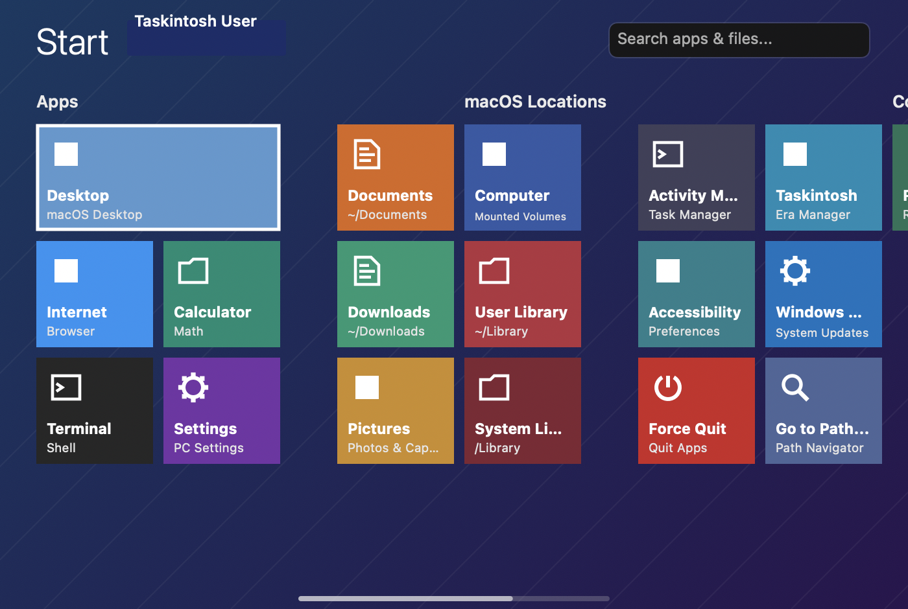
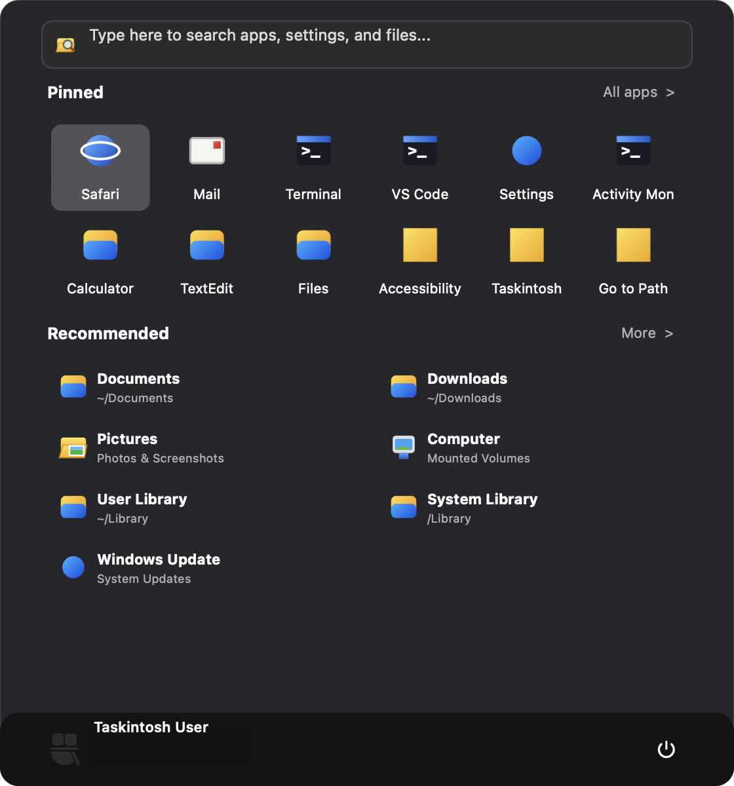
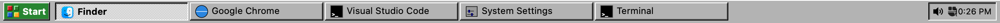
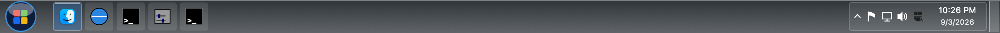
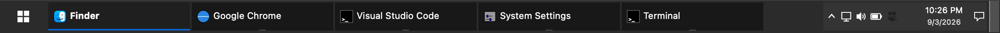
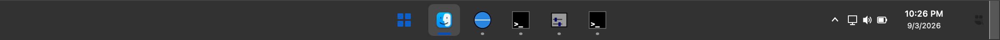

# TASKINTOSH

<p align="center">
  <a href="https://raw.githubusercontent.com/VinceGuyMan/Taskintosh/main/Assets/GitHub/TaskinToshIntro.mp4">
    
  </a>
</p>

> *“Desktop history, openly rebuilt for Mac.”*

**Taskintosh** is a native macOS taskbar recreation and desktop-history platform. It enables Mac users to replace or supplement the traditional macOS Dock with faithful recreations of taskbars, Start menus, system trays, behaviors, animations, and interaction patterns from desktop computing history.

---

```
  +-----------------------------------------------------------------------------------------+
  | [## Start] | [ Safari ] [ Calculator ] [ Terminal ] ...               | [vol][mac] 4:20 PM|
  +-----------------------------------------------------------------------------------------+
```

---

## Core Philosophy

Taskintosh is **not** a superficial skin engine. Different computing eras introduced fundamentally distinct geometries, interaction models, and feedback paradigms.

An **Era** defines:
- **Geometry & Position**: Heights, margins, screen edge docking, multi-monitor alignment.
- **Start Button & Menu**: Tactile 3D bevels, branding banners, hierarchical cascades, and search.
- **Task Management**: Dynamic button sizing, active/sunken states with authentic dither patterns, window minimization, and activation.
- **System Tray & Live Clock**: Sunken bevel status areas, volume popovers, and real-time clock updates.
- **Auto-Hide Mechanics**: Precision mouse-tracking edge triggers with configurable slide animations.
- **Package Architecture**: Self-contained `.taskintosh-era` packs that can be installed without recompiling the application.

---

## Reference Era: Windows 95

Taskintosh ships with six original, legally clean reference Eras: **Windows 95 Classic, Windows XP Luna, Windows 7, Windows 8, Windows 10, and Windows 11**. Earlier experimental era packs are retained in `ArchivedEras/` and are not bundled.

### Procedural Windows Update

For a smaller, delightfully fake side project, Taskintosh also includes [`ProceduralWindowsUpdate`](ProceduralWindowsUpdate/): a deterministic, theatrical Windows Update simulator that never touches the real system. Its centerpiece is an era-authentic Windows 95/98/ME setup dialog, complete with compact Win32 geometry, classic navy title bars, chunky recessed progress bars, generated KB details, stalls, pacing, and optional Taskintosh easter eggs. The isolated Swift package includes a clean interactive preview and test suite, so it can be explored independently of the main taskbar app.

<p align="center">
  <a href="ProceduralWindowsUpdate/README.md">Explore the Procedural Windows Update side project →</a>
</p>

- **Authentic 3D Bevels**: Pixel-accurate raised, sunken, and etched CoreGraphics rendering with genuine light highlight, shadow, and dark shadow borders.
- **Classic Start Button**: Tactile button with original 4-quadrant geometric retro emblem and bold typography.
- **Start Menus**: Era-specific layouts ranging from the Windows 95 Programs cascade to XP's two-column menu, Windows 7's glass menu, Windows 8 tiles, Windows 10's hybrid menu, and Windows 11's centered launcher.
- **Dynamic Task Buttons**: Reflects actual running macOS regular GUI applications. Active applications feature the iconic 50% checkerboard sunken dither pattern; clicking the active button minimizes the app.
- **System Tray**: Sunken bezel clock updating every second, volume indicator, and Era Switcher shortcut.
- **Functional Retro Dialogs**: Genuine **Run...** dialog (opens apps, URLs, paths, terminal commands) and **Shut Down...** dialog (handles macOS sleep, restart, and shutdown).

## Visual Gallery

<p align="center">
  
  
</p>
<p align="center">
  
  
</p>

### Taskbars Across Eras

<p align="center">
  
  
  
</p>
<p align="center">
  
  
  
</p>

---

## Quick Start

### Option 1: Double-Click Launcher (Finder)
Double-click `Launch Taskintosh.command` in the project root. It will compile, package `Taskintosh.app`, and launch it immediately.

### Option 2: Command Line Build & Run
```bash
# Clone or enter directory
cd TaskinTosh

# Build release package
./scripts/package-app.sh

# Launch the app bundle
open build/Taskintosh.app
```

### Option 3: SwiftPM Direct Run
```bash
swift run Taskintosh
```

---

## System Requirements & Permissions

- **Operating System**: macOS 13.0 (Ventura) or later (Apple Silicon & Intel).
- **Zero-Permission Default (App-Level Mode)**: Out of the box, Taskintosh tracks all running applications (`activationPolicy == .regular`), app focus changes, activation, and minimization via `NSWorkspace` notifications with **zero special permissions**.
- **Optional Window-Level Tracking**: If macOS Accessibility permissions are granted, Taskintosh can inspect individual windows, perform targeted window raises, and track minimized states per window. If not granted, Taskintosh falls back gracefully.
- **macOS Dock Coexistence**: Taskintosh includes a one-click helper in the Era Manager to toggle auto-hiding of the native macOS Dock (`defaults write com.apple.dock autohide -bool true && killall Dock`).

---

## Project Structure

```
TaskinTosh/
├── Package.swift                    # SwiftPM manifest (Taskintosh, TaskintoshKit, TaskintoshTests)
├── Launch Taskintosh.command        # Double-clickable Finder launcher
├── scripts/
│   ├── build.sh                     # Build executable
│   ├── run.sh                       # Run in debug mode
│   └── package-app.sh               # Assemble Taskintosh.app bundle
├── Sources/
│   ├── TaskintoshKit/               # Reusable native engine & Era runtime
│   │   ├── Engine/                  # RunningAppWatcher, DisplayManager, AppCatalog, SystemMonitor
│   │   ├── Era/                     # EraPackage, EraManager, EraModels
│   │   ├── Graphics/                # BevelRenderer, ProceduralIcons
│   │   ├── Models/                  # TaskItem
│   │   └── Resources/Eras/          # Bundled .taskintosh-era packages
│   │       ├── Windows95.taskintosh-era/
│   │       ├── WindowsXP.taskintosh-era/
│   │       ├── Windows7.taskintosh-era/
│   │       ├── Windows8.taskintosh-era/
│   │       ├── Windows10.taskintosh-era/
│   │       └── Windows11.taskintosh-era/
│   │           ├── manifest.json
│   │           ├── layout.json
│   │           ├── theme.json
│   │           ├── behaviors.json
│   │           └── assets/
│   └── Taskintosh/                  # Native AppKit UI application
│       ├── AppDelegate.swift        # Application lifecycle & menu bar status item
│       ├── main.swift               # Entry point (accessory activation policy)
│       └── UI/                      # TaskbarPanel, TaskbarView, StartMenuWindow, RunDialog, etc.
├── Tests/TaskintoshTests/           # Unit tests (EraPackageTests, BevelRendererTests, etc.)
├── ARCHITECTURE.md                  # Detailed architectural design
├── ERA-SPEC.md                      # Complete .taskintosh-era format specification
├── DEVELOPMENT.md                   # Development workflow & testing guide
├── ROADMAP.md                       # Vision & planned historical eras
├── LEGAL-ASSET-NOTES.md             # Clean-room legal compliance & asset strategy
└── CHANGELOG.md                     # Release history
```

---

## License & Attribution

Taskintosh is released under the [MIT License](LICENSE). It is an original, clean-room recreation and does **not** contain or redistribute any proprietary Microsoft artwork, copyrighted trademarks, commercial sound files, or binary extracts. See [LEGAL-ASSET-NOTES.md](LEGAL-ASSET-NOTES.md) for full compliance details.

<p align="center">
  
  
</p>
